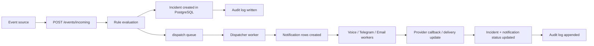

# Architecture Overview

This document describes the current production shape of Seriema: a notification platform built on FastAPI, PostgreSQL, Redis, and Celery.

## Goals

- Ingest events reliably.
- Match events to active rules.
- Dispatch notifications through channel-specific workers.
- Support callbacks and acknowledgements.
- Preserve auditability and operational visibility.

## Main Components

- `FastAPI API`
- `PostgreSQL`
- `Redis`
- `Celery workers`
- `Metabase`
- `Audit log` in PostgreSQL

## Logical Isolation

The platform is designed to share infrastructure with the broader stack while keeping Seriema isolated logically:

- PostgreSQL uses a dedicated schema: `seriema`
- Redis uses a dedicated logical DB: `SERIEMA_REDIS_DB`
- Redis keys use a dedicated prefix: `SERIEMA_REDIS_KEY_PREFIX`
- Celery queues use a dedicated prefix: `SERIEMA_QUEUE_PREFIX`

This keeps the service operationally separate without requiring dedicated infrastructure on day one.

## Event Flow

## Request Lifecycle

1. `POST /events/incoming` receives an event payload.
2. Deduplication runs through Redis using the event `dedupe_key`.
3. Active rules are loaded from PostgreSQL and ordered by `priority`.
4. The first matching active rule is attached to the incident.
5. The incident is persisted in PostgreSQL under the `seriema` schema.
6. An audit entry is written with a shared `trace_id`.
7. The dispatcher task is enqueued on a Seriema-specific queue.
8. The dispatcher creates notification rows and routes work by channel.
9. Channel workers send the notification and update the notification state.
10. Callbacks can acknowledge incidents and append audit entries.

## Worker Responsibilities

- `dispatcher`
- `voice_worker`
- `telegram_worker`
- `email_worker`
- `escalation_worker`
- `replay_dlq`
- `queue_metrics_snapshot`
- `prune_dlq`

### Dispatcher

- Loads the incident and rule.
- Expands the recipient group into contacts.
- Creates notification rows.
- Enqueues channel-specific tasks.
- Writes audit events for queueing.

### Voice Worker

- Sends or simulates the voice call.
- Marks notification state.
- Writes `NOTIFICATION_SENT`.

### Telegram and Email Workers

- Follow the same pattern as voice.
- Keep delivery state and audit trail aligned.

### Escalation Worker

- Runs after the acknowledgement deadline.
- Escalates only if the incident is still `OPEN`.
- Creates fallback notifications according to the rule policy.

### Replay and Maintenance Workers

- `replay_dlq` retries items that reached the DLQ.
- `queue_metrics_snapshot` stores queue depth snapshots in Redis.
- `prune_dlq` keeps the DLQ bounded.

## Callbacks

The system currently exposes a voice callback flow:

- `GET/POST /dispatch/voice/twiml/{notification_id}`
- `POST /dispatch/voice/callback/{notification_id}`

Callback handling includes:

- Optional HMAC signature validation using `VOICE_WEBHOOK_SECRET`
- Timestamp skew validation using `VOICE_WEBHOOK_MAX_AGE_SECONDS`
- Audit logging on callback receipt
- Incident acknowledgement when the callback confirms it

## Storage Model

- `contacts`
- `groups`
- `group_members`
- `rules`
- `incidents`
- `notifications`
- `audit_logs`

Important modeling choices:

- `incidents` are unique per `source + external_event_id`
- `rules` support `active` and `priority`
- `notifications` track channel, status, and provider identifiers
- `audit_logs` store the trace of every important step

## Observability

### API

- `GET /health`
- `GET /health/deps`
- `GET /metrics/sla`
- `GET /metrics/queues`
- `GET /metrics/ops`
- `GET /alerts/ops`
- `GET /ops/integration/status`
- `GET /ops/readiness`
- `GET /ops/dlq/preview`
- `POST /ops/dlq/replay`
- `GET /ops/dlq/replay/last`
- `GET /incidents/{incident_id}/timeline`

### Worker Metrics

- Queue depths are stored in Redis
- Operational counters are stored in a Redis hash
- DLQ size is tracked and pruned
- Failed and sent notifications are counted by channel

### Metabase

Metabase reads from SQL views in the `seriema` schema:

- `v_incident_sla`
- `v_channel_delivery`
- `v_ops_summary_24h`

These views support dashboards for acknowledgement rate, TTA, delivery by channel, and recent operational health.

## Failure Handling

- Redis dedupe prevents repeated ingest processing.
- Celery retries use exponential backoff and jitter.
- Final failures are sent to the DLQ.
- The DLQ can be previewed, replayed, and pruned.
- Retry and replay are idempotent at the database level.

## Operational Notes

- Use the `seriema` schema as the PostgreSQL boundary for this service.
- Use the Seriema Redis DB and queue prefix consistently in every deployment.
- Keep `trace_id` stable across ingest, dispatch, callback, and escalation.
- Treat the audit log as the source of truth for incident history.
